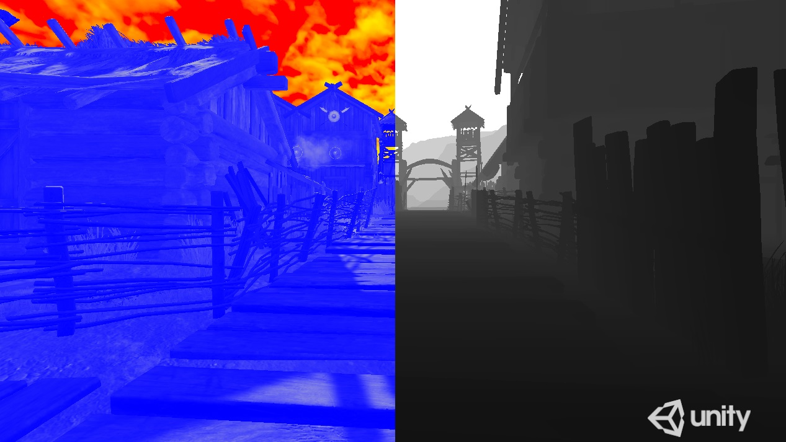

# Unity Post Processing Mod Tool

Author: Przemyslaw Zaworski 
Licence: MIT

Software allows to compile from file and run custom external post processing shaders for Unity standalone builds (DirectX 11). 
Modders usually use generic tools like ReShade to create custom visual effects for games. For Unity engine based games, you have 
now better possibilities. If you are a game developer, analyze code from repository and customize this process for yourself.
Imagine, for your game, you can now provide for players society fully customized framework for creating unbelievable 
visual effects! Tested under Unity 2018.4.20f1. Low overhead (I have over 1700 FPS with default scene and simple desaturation effect).

Repository contains:

* File PostProcessingMod.cpp (it can be edited then compiled into DLL file by Visual Studio command line):
cl.exe /LD PostProcessingMod.cpp d3d11.lib dxguid.lib user32.lib kernel32.lib gdi32.lib d3dcompiler.lib
* Unity project with ready-to-use example.

Usage (for developers):

* Add PostProcessingMod.cs to the Main Camera.
* Assign RenderDepth.shader to the PostProcessingMod script.
* Copy PostProcessingMod.dll into Assets/Plugins.
* Restart editor, then build game.

Usage (for modders):

* Put own HLSL code and save as *.hlsl file into directory: StreamingAssets/Shaders/
* Open StreamingAssets/Shaders/active.txt and save filename to active selected effect.
* Available register(t0) for color texture, register(t1) for depth texture and register(b0) for time variable.
* Run game.
* Debugging - shader errors are written into debug.log file (created in directory with game executable).

To Do:

* 16-bit depth buffer support (currently is available limited 8-bit via blitting and fast Graphics.CopyTexture). 
I tried to get direct handle (ID3D11ShaderResourceView*) to the _CameraDepthTexture with _Material.SetPass(0) 
and PSGetShaderResources (described here: https://developer.nvidia.com/content/gameworks-unity), but without success
(black screen). Second approach, I tried to use Camera.SetTargetBuffers,RenderTextureFormat.Depth for depthmap, 
but I have artifacts for color texture when I use both (color and depth) textures.Third approach I tried to use 
RenderTexture.GetNativeTexturePtr and send pointer to the ID3D11ShaderResourceView *(to avoid Graphics.CopyTexture),
but I have black screen for both color and depth texture.
* Multipass shaders.

Example with Unity Viking Village test scene (left side - color manipulating, right side - linear depth).